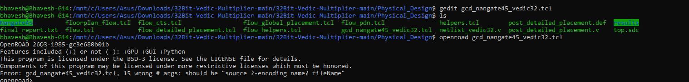
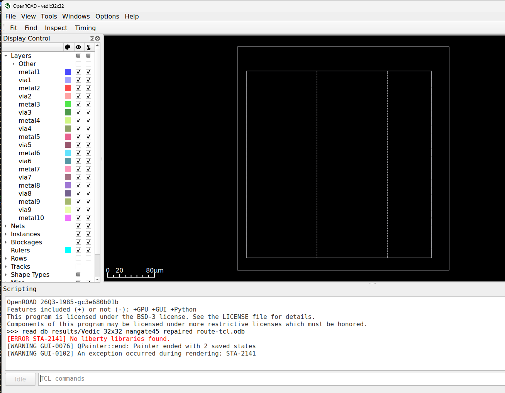
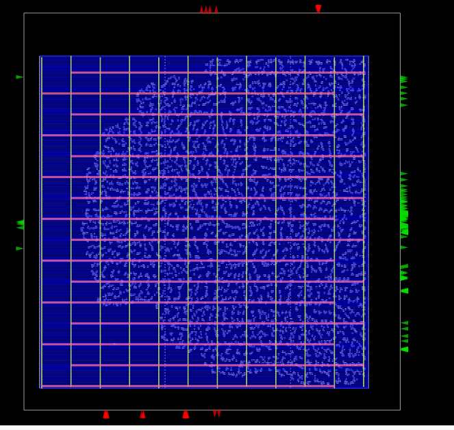
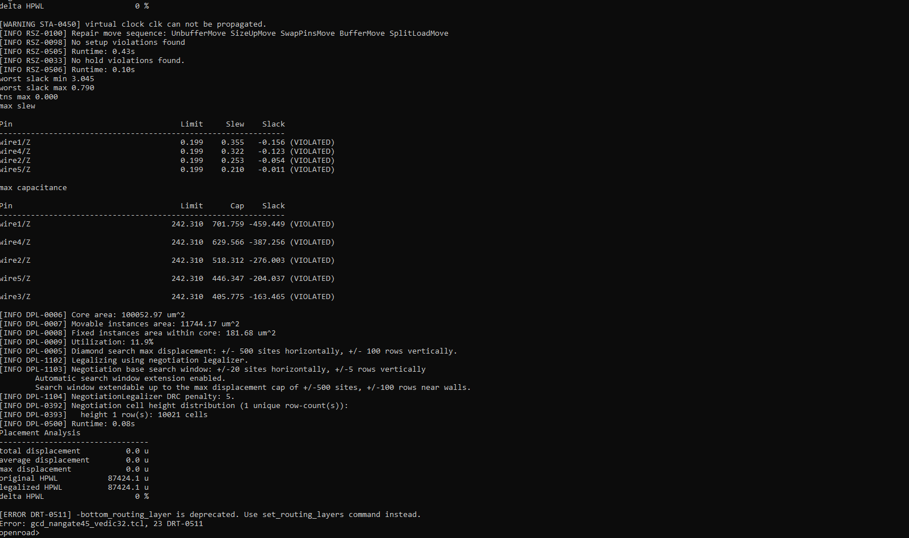
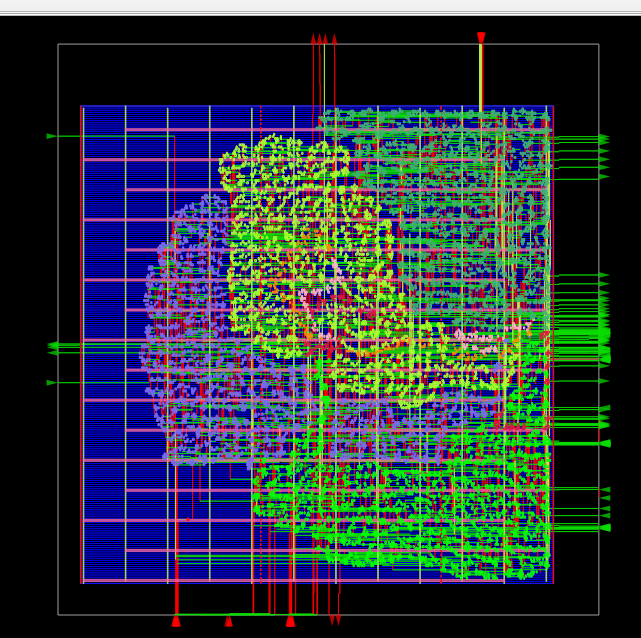

# 32-bit Vedic Multiplier: RTL to GDS

This project implements an unsigned 32-bit hierarchical Vedic multiplier and takes it through an educational RTL-to-GDS flow using open-source ASIC tools on Ubuntu under WSL.

The multiplier follows a recursive structure based on the Urdhva Tiryagbhyam (vertically and crosswise) multiplication idea. Four smaller Vedic multiplier blocks generate partial products at each level, and ripple-carry adders combine them. The current RTL uses RCA4, RCA8, RCA16, and RCA32 modules; it does not use a carry look-ahead adder.

## Tools

- Icarus Verilog: RTL and gate-level simulation
- GTKWave: waveform viewing
- Yosys: synthesis with the Nangate45 standard-cell library
- OpenSTA through OpenROAD: timing and power reporting
- OpenROAD: floorplanning, PDN, placement, routing, extraction, and reporting
- KLayout: final GDS viewing and validation

## Verification

The self-checking testbench compares the DUT output with Verilog multiplication for directed corner cases and 1,000 pseudorandom operand pairs.

- RTL simulation: 1,007/1,007 products passed
- Post-synthesis gate-level simulation: 1,007/1,007 products passed
- A carry-chain defect in the supplied `RCA32.v` was corrected: the upper 16-bit adder now receives `c1`, the carry from the lower 16-bit adder.

## Physical-design results

Technology node: 45 nm using Nangate45 / FreePDK45

| Metric | Result |
|---|---:|
| Die area | 360 × 380 µm |
| Core area | (15, 20) to (330, 340) µm |
| Standard-cell design area | 12,006 µm² |
| Core utilization | 12% |
| Detailed-routing DRC violations | 0 |
| Antenna net violations | 0 |
| Antenna pin violations | 0 |
| Post-route hold slack | +3.044 ns |
| Post-route setup slack | −0.042 ns |
| Post-route setup TNS | −0.042 ns |
| Estimated total power | 95.4 mW |

The design is combinational. `top.sdc` uses a 10 ns virtual clock for input/output timing constraints, so clock-tree synthesis has no physical clock net to build. The final run still reports a small setup violation and maximum slew/capacitance violations on high-fanout nets. This repository therefore documents a completed educational RTL-to-GDS run rather than a signoff-clean tapeout.

## Implementation gallery

All screenshots below were captured during this WSL/OpenROAD project run. Reference and YouTube images are intentionally excluded.

### 1. Starting the physical-design flow

OpenROAD reads the Nangate45 technology LEF, standard-cell LEF, synthesized multiplier netlist, and timing constraints. It then creates the die/core floorplan and standard-cell rows.



### 2. Floorplan and placement rows

The outer white boundary is the 360 × 380 µm die. The inner region is the placement core. The horizontal blue lines are standard-cell rows, while the arrows around the boundary represent input and output pins.



### 3. Global placement

Global placement assigns approximate positions to the synthesized standard cells while minimizing wire length and congestion. Cells are visible across the usable core, and whitespace remains because utilization is approximately 12%.



### 4. Routing compatibility issue found during the run

An older flow script used the deprecated `-bottom_routing_layer` option. OpenROAD stopped at detailed routing with `DRT-0511`. The script was updated to use the current routing-layer setup, after which the flow completed.



### 5. Final placed and routed layout

The final OpenROAD view shows placed standard cells, the power grid, routed signal metals, and boundary pins. Its appearance differs from older OpenROAD demonstrations because placement decisions, routing, tool version, hierarchy colors, and display settings can vary.



## Run RTL verification

Open Ubuntu/WSL and run:

```bash
cd "/mnt/c/Users/Asus/Downloads/32Bit-Vedic-Multiplier-main/32Bit-Vedic-Multiplier-main/Functional_Verification"
iverilog -Wall -o Vedic32.vvp FA.v HA.v RCA4.v RCA8.v RCA16.v RCA32.v vedic2x2.v vedic4x4.v vedic8x8.v vedic16x16.v vedic32x32.v vedic32x32_Test.v
vvp Vedic32.vvp
gtkwave Vedic32x32.vcd &
```

## Run synthesis

```bash
cd "/mnt/c/Users/Asus/Downloads/32Bit-Vedic-Multiplier-main/32Bit-Vedic-Multiplier-main/Logic_Synthesis"
yosys -s synth.tcl | tee synthesis_fixed.log
```

Copy the verified synthesized netlist into `Timing_Power_Checks` and `Physical_Design` before running those stages.

## Run physical design

```bash
cd "/mnt/c/Users/Asus/Downloads/32Bit-Vedic-Multiplier-main/32Bit-Vedic-Multiplier-main/Physical_Design"
openroad gcd_nangate45_vedic32.tcl | tee corrected_physical_flow.log
```

View the final OpenROAD database:

```bash
openroad -gui view_final.tcl
```

View the final GDS:

```bash
klayout results/Vedic32_final.gds &
```

## Directory structure

- `Functional_Verification/`: hierarchical Verilog RTL, self-checking testbench, and waveform output
- `Logic_Synthesis/`: synthesis script, Nangate45 liberty data, and synthesized netlist
- `Timing_Power_Checks/`: constraints, netlist, timing script, and reports
- `Physical_Design/`: OpenROAD flow scripts, platform data, reports, DEF, and GDS
- `Results/`: images from the implementation flow

## Attribution

The original source files retain their existing author headers, including files credited to Shivraj Babar. This repository records the corrected verification and open-source physical-design learning run. No upstream license file was included in the downloaded source archive; confirm the original source terms before publishing a public redistribution.
